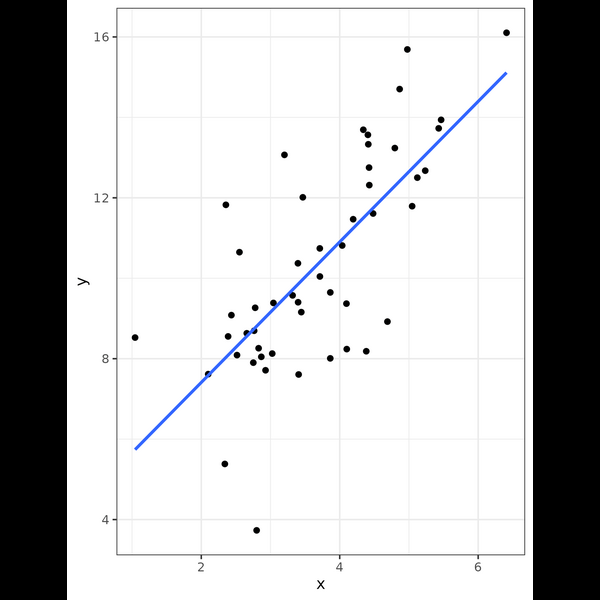

```{python}
#| include: false
#| eval: true
#| label: setup

import numpy as np
import pandas as pd
import statsmodels.formula.api as smf
from IPython.display import display
from plotnine import *
from plotnine.data import penguins as penguins_data

# Reproducible random-number seeds
RANDOM_SEED = 909

# Data for the line-fitting examples
line_rng = np.random.default_rng(RANDOM_SEED)
x = line_rng.normal(loc=4, scale=1, size=50)
y = 3 + 2 * x + line_rng.normal(loc=0, scale=2, size=50)
df = pd.DataFrame({"x": x, "y": y})

# Palmer Penguins data and analysis-specific complete-case datasets
penguins = penguins_data.copy()
penguins_scatter = penguins.dropna(
    subset=["body_mass_g", "flipper_length_mm"]
).copy()
penguins_continuous = penguins.dropna(
    subset=["body_mass_g", "flipper_length_mm", "bill_length_mm"]
).copy()
penguins_categorical = penguins.dropna(
    subset=["body_mass_g", "flipper_length_mm", "island"]
).copy()
penguins_categorical["island"] = pd.Categorical(
    penguins_categorical["island"],
    categories=["Biscoe", "Dream", "Torgersen"],
)

# Data for the simple linear-regression simulation
simulation_rng = np.random.default_rng(RANDOM_SEED + 1)
simulation_x = simulation_rng.normal(loc=3, scale=1, size=250)
simulation_expected_y = 3 * simulation_x + 20
simulation_error = simulation_rng.normal(loc=0, scale=2, size=250)
simulation_y = simulation_expected_y + simulation_error
simulation_data = pd.DataFrame(
    {
        "x": simulation_x,
        "expected_y": simulation_expected_y,
        "error": simulation_error,
        "y": simulation_y,
    }
)

# Data for the multivariable-regression simulation
mlr_rng = np.random.default_rng(RANDOM_SEED + 2)
mlr_x1 = mlr_rng.normal(loc=2, scale=1, size=1_000)
mlr_x2 = mlr_rng.normal(loc=-4, scale=1, size=1_000)
mlr_y = (
    3
    + 2 * mlr_x1
    + 4 * mlr_x2
    + mlr_rng.normal(loc=0, scale=np.sqrt(2), size=1_000)
)
mlr_simulation = pd.DataFrame(
    {"x1": mlr_x1, "x2": mlr_x2, "y": mlr_y}
)

# Set the default Plotnine theme
theme_set(theme_bw())
```

## Learning Objectives

-   Linear Regression
-   Multivariable Linear Regression


## Scatter Plot

```{python}
# Scatterplot
(
    ggplot(
        penguins_scatter,
        aes(x="body_mass_g", y="flipper_length_mm"),
    )
    + geom_point()
)
```

# Linear Regression

## Linear Regression

Linear regression is used to model the association between a set of predictor variables (x's) and an outcome variable (y). Linear regression will fit a line that best describes the data points.

## Scatter Plot

```{python}
# Scatterplot
(
    ggplot(
        penguins_scatter,
        aes(x="body_mass_g", y="flipper_length_mm"),
    )
    + geom_point()
)
```

## Simple Linear Regression

Simple linear regression will model the association between one predictor variable and an outcome:

$$
Y = \beta_0 + \beta_1 X + \epsilon
$$

-   $\beta_0$: Intercept term

-   $\beta_1$: Slope term

-   $\epsilon\sim N(0,\sigma^2)$

## Estimated Model

$$
\hat Y = \hat \beta_0 + \hat \beta_1 X
$$

## Process

{fig-align="center"}

## Process

```{python}
# Fit the linear model
fit = smf.ols("y ~ x", data=df).fit()

# Predicted values
df["pred"] = fit.predict(df)

# Plot
(
    ggplot(df, aes(x="x", y="y"))
    + geom_point(size=2)
    + geom_segment(
        aes(x="x", xend="x", y="y", yend="pred")
    )
    + geom_smooth(method="lm", se=False)
)
```


## Sums of Error Squared

$$
RSS = \sum^n_{i=1}(Y_i-\hat Y_i)^2
$$

## Searching

```{python}
def finderr(x, m, b):
    """Calculate predicted values from a slope and intercept."""
    return m * x + b


# Slope and intercept
a = 2.4395
b = 1.363008

# Predicted values and residual sum of squares
df["pred"] = finderr(df["x"], a, b)
rss = np.sum((df["y"] - df["pred"]) ** 2)

# Plot
(
    ggplot(df, aes(x="x", y="y"))
    + geom_point(size=2)
    + geom_segment(
        aes(x="x", xend="x", y="y", yend="pred")
    )
    + geom_abline(slope=a, intercept=b)
    + annotate(
        "text",
        x=2.75,
        y=16,
        label=f"RSS: {rss:.2f}",
    )
)
```

## Searching

```{python}
a = -0.15341
b = 10.9204

df["pred"] = finderr(df["x"], a, b)
rss = np.sum((df["y"] - df["pred"]) ** 2)

(
    ggplot(df, aes(x="x", y="y"))
    + geom_point(size=2)
    + geom_segment(
        aes(x="x", xend="x", y="y", yend="pred")
    )
    + geom_abline(slope=a, intercept=b)
    + annotate(
        "text",
        x=2.75,
        y=16,
        label=f"RSS: {rss:.2f}",
    )
)
```

## Searching

```{python}
a = 2.0073747
b = 2.955920

df["pred"] = finderr(df["x"], a, b)
rss = np.sum((df["y"] - df["pred"]) ** 2)

(
    ggplot(df, aes(x="x", y="y"))
    + geom_point(size=2)
    + geom_segment(
        aes(x="x", xend="x", y="y", yend="pred")
    )
    + geom_abline(slope=a, intercept=b)
    + annotate(
        "text",
        x=2.75,
        y=16,
        label=f"RSS: {rss:.2f}",
    )
)
```

## Searching

```{python}
a = 1.575194
b = 4.548833

df["pred"] = finderr(df["x"], a, b)
rss = np.sum((df["y"] - df["pred"]) ** 2)

(
    ggplot(df, aes(x="x", y="y"))
    + geom_point(size=2)
    + geom_segment(
        aes(x="x", xend="x", y="y", yend="pred")
    )
    + geom_abline(slope=a, intercept=b)
    + annotate(
        "text",
        x=2.75,
        y=16,
        label=f"RSS: {rss:.2f}",
    )
)
```

## Final

```{python}
fit = smf.ols("y ~ x", data=df).fit()
df["pred"] = fit.predict(df)
rss = np.sum(fit.resid**2)

(
    ggplot(df, aes(x="x", y="y"))
    + geom_point(size=2)
    + geom_segment(
        aes(x="x", xend="x", y="y", yend="pred")
    )
    + geom_smooth(method="lm", se=False)
    + annotate(
        "text",
        x=2.75,
        y=16,
        label=f"RSS: {rss:.2f}",
    )
)
```


# Linear Regression Simulation

## Generate X Values

Simulate 250 independent values (x) from $N(3, 1)$ and plot a histogram

```{python}
#| echo: true
#| eval: false

x = np.random.normal(loc=3, scale=1, size=250)
```

## Generate Y Values

Create a new variable with the following formula:

$$
Y_i = 3 X_i + 20
$$
Create a Scatter Plot

## Generate Error Term

Generate $\epsilon_i\sim N(0, 2)$

Create a histogram

## Add error term

Create final form of $Y_i$:

$$
Y_i = 3 X_i + 20 + \epsilon_i
$$

Create a scatter plot


## Simulation Study

To confirm that `smf.ols()` works, repeat the process 100 times and obtain the average $\beta$ estimates:

1.  Generate 250 X values
2.  Create Y Value
3.  Add error term
4.  Fit Model
5.  Store Values
6.  Find the means of the coefficient

## Python Code of Simulation Study

```{python}
#| echo: true

# Generating seends
simulation_seeds = np.arange(1_000) + RANDOM_SEED


# Simulation study
def simulate_coefficients(seed):
    local_rng = np.random.default_rng(seed)
    x = local_rng.normal(loc=3, scale=1, size=250)
    expected_y = 3 * x + 20
    error = local_rng.normal(loc=0, scale=2, size=250)
    y = expected_y + error

    simulated_data = pd.DataFrame({"x": x, "y": y})
    result = smf.ols("y ~ x", data=simulated_data).fit()
    return result.params


sim_results = pd.DataFrame(
    [simulate_coefficients(seed) for seed in simulation_seeds]
)
sim_results.mean().rename("mean_estimate").to_frame()
```

# Multivariable Linear Regresion

## MLR

Multivariable linear regression models are used when more than one explanatory variable is used to explain the outcome of interest.

## Continuous Variable

To fit an additional continuous random variable to the model, we will only need to add it to the model:

$$Y = \beta_0 +\beta_1 X_1 + \beta_2 X_2$$

## Example

Using the Palmer Penguins data, fit a model with `body_mass_g` as the outcome and `flipper_length_mm` and `bill_length_mm` as predictors.

```{python}
#| echo: true

continuous_model = smf.ols(
    "body_mass_g ~ flipper_length_mm + bill_length_mm",
    data=penguins_continuous,
).fit()

continuous_model.summary()
```

## Interpretation

```{python}
#| eval: true

continuous_model.summary()
```

## Categorical Variable

A categorical variable can be included in a model, but a reference category must be specified.

## Fitting a model with categorical variables

To fit a model with categorical variables, we must utilize dummy (binary) variables that indicate which category is being referenced. We use $C-1$ dummy variables where $C$ indicates the number of categories. When coded correctly, each category will be represented by a combination of dummy variables.

## Example

If we have 4 categories, we will need 3 dummy variables:

|         | Cat 1 | Cat 2 | Cat 3 | Cat 4 |
|---------|-------|-------|-------|-------|
| Dummy 1 | 1     | 0     | 0     | 0     |
| Dummy 2 | 0     | 1     | 0     | 0     |
| Dummy 3 | 0     | 0     | 1     | 0     |

Which one is the reference category?

## Fitting a model with categorical variables

Using the Palmer Penguins data, fit a model with `body_mass_g` as the outcome and `flipper_length_mm` and `island` as predictors.

```{python}
#| echo: true

categorical_model = smf.ols(
    "body_mass_g ~ flipper_length_mm + C(island)",
    data=penguins_categorical,
).fit()

categorical_model.summary()
```


# MLR Simulation Study 

## Simulation Study

Simulate 1000 random variables from the following model:

$$Y = 3 + 2X_1 + 4X_2 + \epsilon$$

- $X_1\sim N(2,1)$

- $X_2\sim N(-4,1)$

- $\epsilon\sim N(0, 2)$

```{python}
#| echo: true
#| eval: false

# The executed data are created in the setup chunk.
# Equivalent Python generation code:
rng = np.random.default_rng(911)
x1 = rng.normal(loc=2, scale=1, size=1_000)
x2 = rng.normal(loc=-4, scale=1, size=1_000)
y = 3 + 2 * x1 + 4 * x2 + rng.normal(
    loc=0,
    scale=np.sqrt(2),
    size=1_000,
)
mlr_simulation = pd.DataFrame({"x1": x1, "x2": x2, "y": y})
```

## Fit Model

Fit a model between $Y$ and $X_1$.

Repeat the process 1000 times. and answer the following questions:

- On average does $\beta_1$ get estimated correctly? Why?

- What is the average model variance?

## MLR Model

Instead of fitting a simple linear regression model. Fit a model that will include predictor $X_2$. This can be done by adding $X_2$ in Python:

```{python}
#| echo: true

mlr_model = smf.ols("y ~ x1 + x2", data=mlr_simulation).fit()
mlr_model.summary()
```

Modify your simulation study and see what happens to $\beta_1$ and the model variance.


# Matrix Formulation

## Matrix Formulation

$$Y_i = \boldsymbol X_i^\mathrm T \boldsymbol \beta + \epsilon_i$$

- $Y_i$: Outcome Variable

- $\boldsymbol X_i$: Predictors

- $\boldsymbol \beta$: Coefficients

- $\epsilon_i$: error term

## Matrix Formulation

$$\boldsymbol\beta = (\boldsymbol X^\mathrm T \boldsymbol X)^{-1} \boldsymbol X^\mathrm T \boldsymbol Y$$

